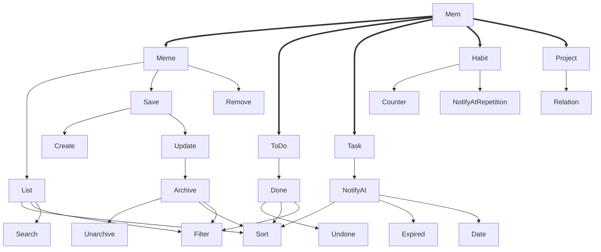

# 開発ロードマップ

```mermaid
flowchart TD
    Mem ==> Memo

    Memo --> List
    Memo --> Save
    Save --> Create
    Save --> Update
    Update --> Archive
    Archive --> Unarchive
    Archive --> Sort
    List --> Sort
    Archive --> Filter
    List --> Filter
    Memo --> Remove
    List --> Search

    Mem ==> ToDo
    ToDo --> Done
    Done --> Undone
    Done --> Sort
    Done --> Filter

    Mem ==> Task
    Task --> NotifyAt
    NotifyAt --> Sort
    NotifyAt --> Expired
    NotifyAt --> Date

    Mem ==> Habit
    Habit --> Counter
    Habit --> NotifyAtRepetition

    Mem ==> Project
    Project --> Relation
```