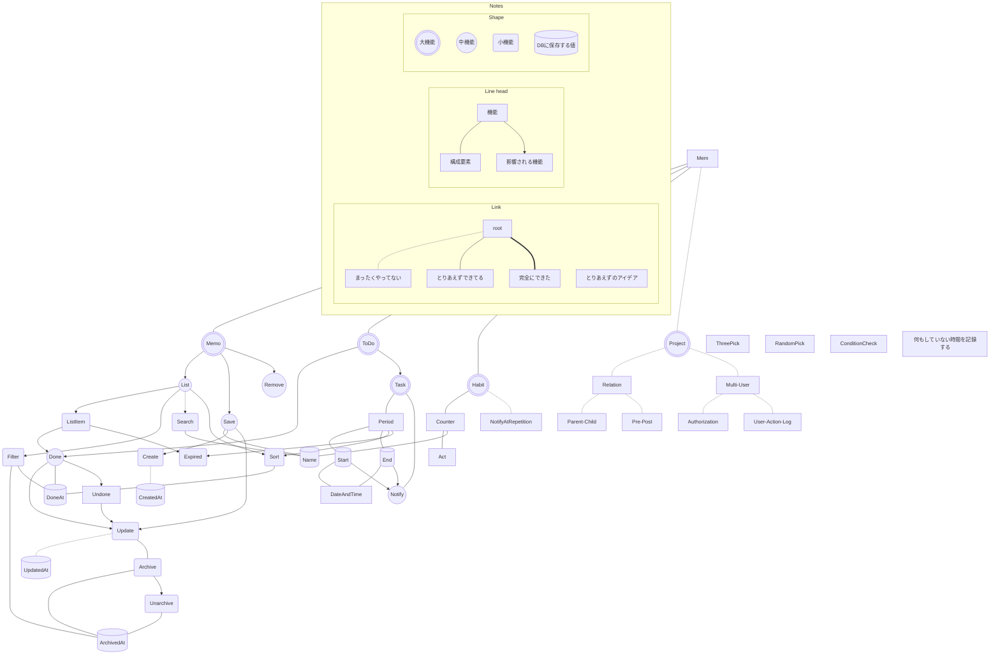

# 開発ロードマップ

```mermaid
flowchart TD
    Mem --- Memo(((Memo)))

    Memo --> List((List))
    Memo --> Save((Save))
    Memo --> Remove((Remove))
    List --> ListItem(ListItem)
    Save --- Name[(Name)]
    Save --> Create(Create)
    Save --> Update(Update)
    Create -.- CreatedAt[(CreatedAt)]
    Update -.- UpdatedAt[(UpdatedAt)]
    Update --- Archive(Archive)
    Archive --- ArchivedAt[(ArchivedAt)]
    Archive --> Unarchive(Unarchive)
    Unarchive --- ArchivedAt

    List --> Filter(Filter)
    List -.-> Search(Search)
    Filter --- ArchivedAt
    Search --- Name

    Mem --- ToDo(((ToDo)))

    ToDo --> Done((Done))
    ListItem --> Done
    Done --> Update
    Done --- DoneAt[(DoneAt)]
    Done --> Undone
    Undone --> Update
    List --> Sort(Sort)
    Sort --- DoneAt
    Filter --- DoneAt

    ToDo --> Task(((Task)))

    Task --- Period
    Task --- Notify((Notify))
    Period --- Start[(Start)]
    Period --- End_[(End)]
    Start --- DateAndTime
    Start --> Notify
    End_ --- DateAndTime
    End_ --> Notify
    Period --> Sort
    ListItem --> Expired(Expired)
    Period --> Expired

    Mem --- Habit(((Habit)))

    Habit --- Counter
    Counter --- Act
    Counter --- Name
    Habit -.- NotifyAtRepetition

    Mem -.- Project(((Project)))

    Project -.- Relation
    Relation -.- Parent-Child
    Relation -.- Pre-Post
    Project -.- Multi-User
    Multi-User -.- Authorization
    Multi-User -.- User-Action-Log

    Mem ~~~ ThreePick
    Mem ~~~ RandomPick
    Mem ~~~ ConditionCheck
    Mem ~~~ LogNothingTime[何もしていない時間を記録する]

    subgraph Notes
        subgraph Link
            root -.- まったくやってない
            root --- とりあえずできてる
            root === 完全にできた
            root ~~~ とりあえずのアイデア
        end

        subgraph Line head
            機能 --- 構成要素
            機能 --> 影響される機能
        end

        subgraph Shape
            ex1(((大機能)))
            ex2((中機能))
            ex3(小機能)
            ex4[(DBに保存する値)]
        end
    %% - できてないやつは簡単に追加したい
    %%   - 装飾なし
    %%     - 角
    %% - できたやつは対比で丸？
    %%   - 出来具合で丸くなってく？
    %%     - 内容を表すために形を使うべきな気がしてきた
    %%   - 線で出来具合を表した方が良い？
    end
```
