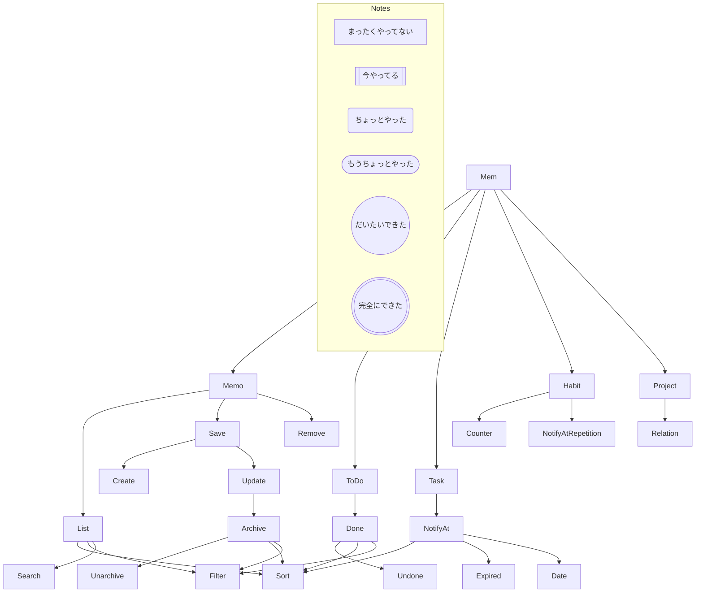

# 開発ロードマップ

```mermaid
flowchart TD
    Mem --> Memo
    Mem --> ToDo
    Mem --> Task
    Mem --> Habit
    Mem --> Project

    Memo --> List
    Memo --> Save
    Save --> Create
    Save --> Update
    Update --> Archive
    Archive --> Unarchive
    Archive --> Sort
    List --> Sort
    Archive --> Filter
    List --> Filter
    Memo --> Remove
    List --> Search

    ToDo --> Done
    Done --> Undone
    Done --> Sort
    Done --> Filter

    Task --> NotifyAt
    NotifyAt --> Sort
    NotifyAt --> Expired
    NotifyAt --> Date

    Habit --> Counter
    Habit --> NotifyAtRepetition

    Project --> Relation

    subgraph Notes
        まったくやってない
        e[[今やってる]]
        c(ちょっとやった)
        d([もうちょっとやった])
        a((だいたいできた))
        b(((完全にできた)))
    end
```
