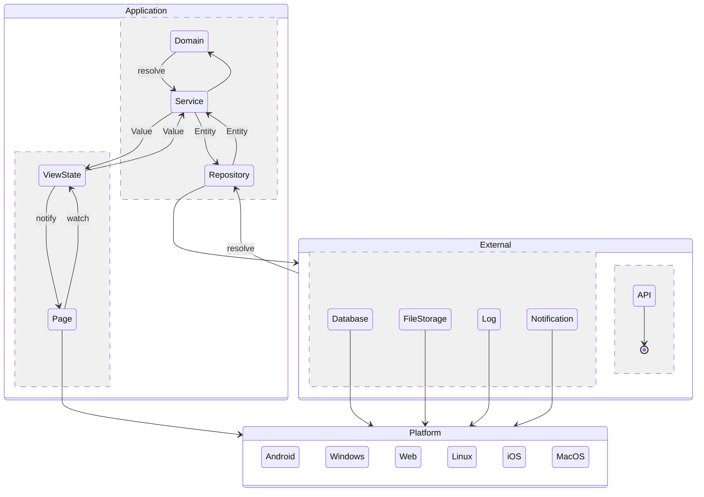

# Architecture

## Software architecture

```mermaid
stateDiagram-v2
  state Application {
    Domain --> Service : resolve
    Service --> Domain

    Service --> ViewState : Value
    ViewState --> Service : Value
    Service --> Repository : Entity
    Repository --> Service : Entity
    
    --
    
    Page --> ViewState : watch
    ViewState --> Page : notify
  }

  Repository --> External
  External --> Repository : resolve

  state External {
    Database
    FileStorage
    Log
    Notification

    --

    API --> [*]
  }

  state Platform {
    Android
    Windows
    Web
    Linux
    iOS
    MacOS
  }

  Page --> Platform
  Database --> Platform
  FileStorage --> Platform
  Log --> Platform
  Notification --> Platform
```

### Domain

### View

### Repository
